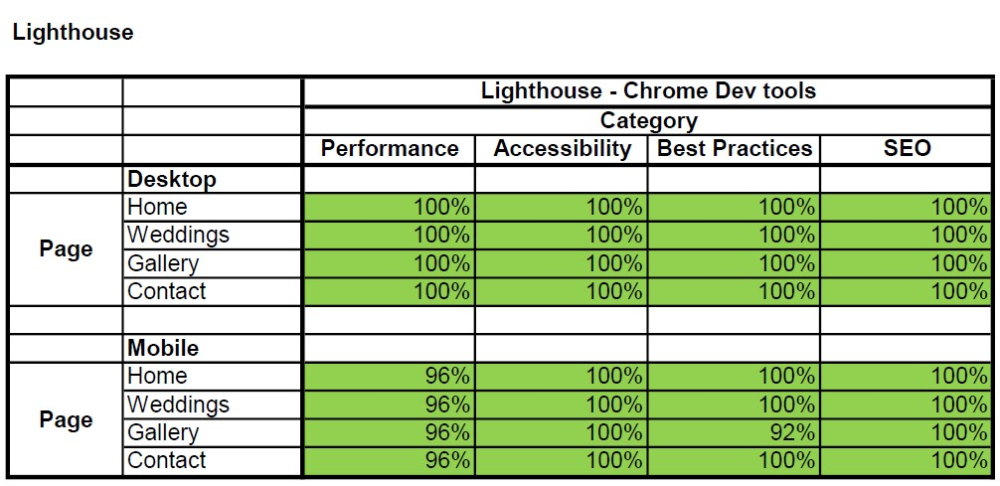

# **Joanne Geraghty Music**

The ‘Joanne Geraghty Music’ site provides a hub for Jo’s music business. It caters for fans, potential fans, prospective and current clients and curious visitors by providing the information and features required for the type of user in question to fulfil their objective or objectives. This is done through provision of details commonly sought by these user groups and provision of the intuitively arranged features they require.
 It was a goal of the design process to develop a site that would provide for a type of user’s needs without being to the detriment of another type of user. This being the case would lead to a less positive user experience. 
The overall objective is for the site to be an enjoyable destination for any user, for it to enable the user to make the most of Jos music and Jo, in turn, to gain and retain followers, increase bookings and sales and build a thriving fan base that attends her performances regularly. 

## **Contents**

1 [Project Initiation](#project-initiation)

## **1. Project Initiation**

1. Brainstorming sessions helped to ascertain the business and user needs:

    [Business opportunities and business and user needs brainstorm](docs/readme-brainstorm.pdf)

2. The opportunities were assessed for importance and viability and the minimum viable product was ascetertained:

    [Minimum viable product analysis spreadsheet](docs/readme-opportunity-analysis.pdf)

    [Minimum viable prodct analysis charts](docs/readme-scope-analysis.pdf)

4.  User needs were checked to make sure they satisfy a business opportunity:

    [User need to business opportunity connection analysis](docs/readme-user-need-business-opporuntity-link.pdf)

5. User stories were developed:

    [User stories](docs/readme-user-stories.pdf)

6. A feature list was developed from the user stories and it was ensured that the was no duplicated functionality going into development:

    [Feature list](docs/readme-feature-list.pdf)

## **Product Development**

### **Poduct Functionailty development**
- Wireframes were developed for a site that incorporated all of the required features identified during project initiation to ensure all required functions were provided for.

  - [Landing page wireframes](docs/wireframes-landing-page.pdf)

  - [Weddings page wireframes](docs/wireframes-weddings-page.pdf)

  - [Gallery page wireframes](docs/wireframes-gallery-page.pdf)

  - [Contact form page wireframes](docs/wireframes-contact-form-page.pdf)

  - [User interface flow](docs/user-interface-flow.pdf)

  - [Mockup with colour scheme](docs/mockup-colour-scheme.pdf)

### **Product Style Development**

- Typography

- Colour scheme

- Images

- Layout

## **Features**

### **Style and Feedback Features**

### **Implemented Functional Features**

- **Logo**

    The Logo

- **Navigation Bar**

    The navigations Bar

### **Features Left to Implement**

## **Testing**

### **Functionality tests**

### **Performance tests**

- Lighthouse tests in dev tools in Chrome were used to verify that that website performed as required.

### **Compatibility tests**

Bugs found and fixed or outstanding

## **Deployment**

## **Technologies Used**

- CSS

- HTML

- [Corel Draw](https://www.coreldraw.com/en/) : Used for developing the wireframes and mockups for the product

- [Corel Photo-Paint](https://www.coreldraw.com/en/pages/photo-paint/) : Used for cropping and adjusting the photos used in the product

- [VLC](https://www.videolan.org/) : Used for transcoding video

- IOS Photos App : Used to crop videos to square aspect ratio

- [Microsoft Excel](https://www.microsoft.com/en-ie/microsoft-365/excel) : Used for documenting features and recording test results

- [Chrome](https://www.google.com/intl/en_ie/chrome/) : USed for research, development and testing (including DevTools and Lighthouse test suite)

- [Safari](https://www.apple.com/safari/) : Used for testing

- [Opera](https://www.opera.com/) : Used for testing

- [Edge](https://www.microsoft.com/en-us/edge) : Used for testing

- [Firefox](https://www.mozilla.org/en-US/firefox/new/) : Used for testing

- [Notepad++](https://notepad-plus-plus.org/downloads/) : Used for text file editing

- [Gitpod](https://www.gitpod.io/) : Used for product development and testing

- [Github](https://github.com/) : Used for accessing committed code repositories and hosting the completed product online

- [Git](https://git-scm.com/): Used for code version control

- [Tinyjpg](https://tinyjpg.com/) : Used for image compression

- [Google Fonts](https://fonts.google.com/about) : Used for fonts

- [Font Awsome](https://fontawesome.com/) : Used to source social media svg files

- Code Institute form Dump : Form data is sent to this form dump in lieu opf implemention of a custom back end process to handle the incomming form posts 

## **Credits**

### **Content**

- All code was written by the author, Stephen Whitaker

- The fonts "Great Vibes" and Lato were sourced on [Google Fonts](https://fonts.google.com/about)

### **Media**

- All photos and videos are those of author (Stephen Whitaker) and his wife (Joanne Whitaker)

### **External Dependencies**

- Conde Institute from dump : Form posts are currently sent to the Code Institue form dump in lieu of a custom back end process to handle the form posts correctly. Implention of such processes was beyound the scope of this project.

### **Other sources**

- Guidance on the markdown and structure to produce the readme was obtained from :

   - [Markdown Cheatsheet](https://github.com/adam-p/markdown-here/wiki/Markdown-Cheatsheet#code)

   - [Markdown for readme](https://docs.github.com/en/get-started/writing-on-github/getting-started-with-writing-and-formatting-on-github/basic-writing-and-formatting-syntax)

### **Acknowledgements**

- A special thank you to my mentor Maranatha Ilesanmi

- Thank you to all those who were kind enough to test and provide feedback on the product