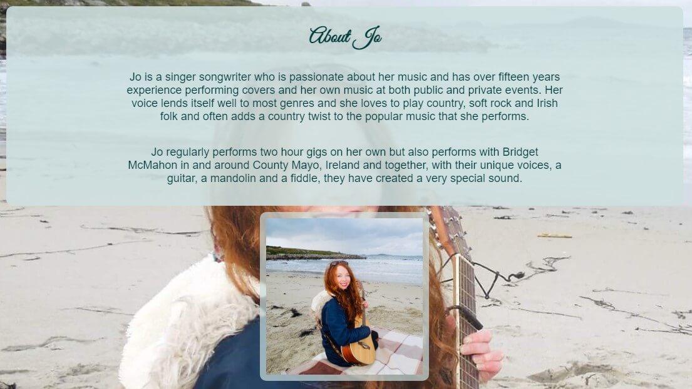
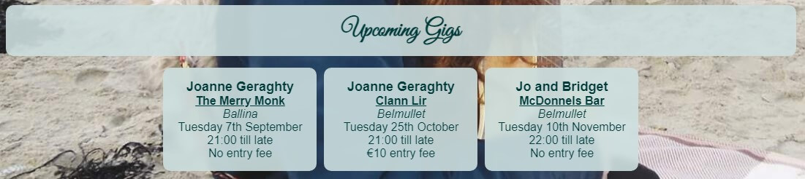

# **Joanne Geraghty Music**
The [‘Joanne Geraghty Music’](https://stephen-j-whitaker.github.io/joanne-geraghty-music/index.html) site provides a hub for Jo’s music business. It caters for fans, potential fans, prospective and current clients and curious visitors by providing the information and features required for the type of user in question to fulfil their objective or objectives. This is done through provision of details commonly sought by these user groups and provision of the intuitively arranged features they require.
 It was a goal of the design process to develop a site that would provide for a type of user’s needs without being to the detriment of another type of user. This being the case would lead to a less positive user experience. 
The overall objective is for the site to be an enjoyable destination for any user, for it to enable the user to make the most of Jos music and Jo, in turn, to gain and retain followers, increase bookings and sales and build a thriving fan base that attends her performances regularly. 

## **Contents**

<!-- put feature links in contents -->
1 [Project Initiation](#project-initiation)

## **1. Project Initiation**
1. Brainstorming sessions helped to ascertain the business and user needs:

    [Business opportunities and business and user needs brainstorm](docs/readme-brainstorm.pdf)

2. The opportunities were assessed for importance and viability and the minimum viable product was ascetertained:

    [Minimum viable product analysis spreadsheet](docs/readme-opportunity-analysis.pdf)

    [Minimum viable prodct analysis charts](docs/readme-scope-analysis.pdf)

4.  User needs were checked to make sure they satisfy a business opportunity:

    [User need to business opportunity connection analysis](docs/readme-user-need-business-opporuntity-link.pdf)

5. User stories with acceptance criteria were developed:

    [User stories](docs/readme-user-stories.pdf)

6. A feature list was developed from the user stories and it was ensured that the was no duplicated functionality going into development. These have acceptance criteria:

    [Feature list](docs/readme-feature-list.pdf)

## **2. Product Development**
### **Poduct Functionailty development**
### Wireframes 
Wireframes were developed for a site that incorporated all of the required features identified during project initiation to ensure all required functions were provided for.

  - [Landing page wireframes](docs/readme-wireframes-landing-page.pdf)

  - [Weddings page wireframes](docs/readme-wireframes-weddings-page.pdf)

  - [Gallery page wireframes](docs/readme-wireframes-gallery-page.pdf)

  - [Contact form page wireframes](docs/readme-wireframes-contact-form-page.pdf)

  - [User interface flow](docs/readme-user-interface-flow.pdf)

  - [Mockup with colour scheme](docs/readme-mockup-colour-scheme.pdf)

### **Product Style Development**
- ### Typography
  It was decided to use one cursive font and one sans serif font throughout the site. The cursive font Great Vibes ([Google Fonts](https://fonts.google.com/about)) is used for the logo and the headings on all the web pages and the sans serif font Arial is used for all other text. The use of the same 2 preffered fonts on all pages provides continuity and is intended to help the pages look unclutttered and make the site a more pleasant place to be for it's users.

- ### Colour Scheme
  The mint green colour scheme and small pallete used for the user interface was chosen to make the site appear 'fresh' and 'light' and so help to envoke positive emotions in the user. The semi-transparency of the interface is to add to the sense 'lightness' and to provide a sense of depth to the site. The colours are used consistently throughout the site with the headers and footers being one tone of mint green and the main body of the pages being a lighter tone of mint green. All other colour is provided by the background images and, where present, gallery pictures and videos. A mix of grey scale and colour videos and photos was chosen and arranged to provide balance to the pages in which they are present without introducing clashing or overly vibrant colours that would work against the use of a mint theme used to convey a sense of calm.  

- ### Images
  The full viewport background images with the semi transparent user interface was chosen to give an ethereal 'lightness' and depth to the site. All the images and videos used in the galleries are cropped to a square aspect ratio and same size for consistency and therefore to help produce a positive emotional response in the user.  

- ### Layout
  A simple and consistent full page scroll with a header and 'sticky' footer was chosen as it is familiar with internet users and will be intuitive to navigate. The layout is fully responsive and, for consistency, all the features look the same on all screen sizes (although some, like the navigation bar, are arranged differently and wrap under other objects for smaller screen sizes). The header and footer is the same on all pages. With the exception of the weddings page the background image is the same on all pages for consistency. The wedding page has a wedding themed background image as deayiled in teh features specification.

- ### User Feedback
  Any clickable or interactive feature or link will have a style change in response to an on hover event to identify the feature as interactive to the user. The change in style on occurence of a hover event is detailed in the features section.

## **3. Features**
### **Implemented Functional Features**
Features are arranged and combined, when appropriate, into the website in what was deemed to be the most intuitive and efficient manner. Multiple user stories may be dependent on a given feature and this is noted in the descriptions below. User 'story links' in this section of the readme are to the user story details and acceptance criteria for reference and the 'feature' in this section of teh readme are to the acceptance criteria for the features.
- ### Landing page [[Feature](docs/readme-feature-list.pdf) 'Landing Page' (ID 3)]
  - The 'Landing page' (ID 3) [feature](docs/readme-feature-list.pdf) is a dependency of all of the [user stories](docs/readme-user-stories.pdf). 

  The landing page (Home) is the site visitors welcome to the site. The background picture is Jo with a guitar to indicate she is a musician and if a user has seen Jo they will know on seeing the background image that they have found the correct site. In case the background image is partially obscured by the objects on the page there is also the same picture of Jo in the about Jo section of the 'Home' Landing Page.
 
   

   - #### Header and Footer
     The Landing page contains a header and a footer that is repeated on all of the websites pages for continuity, easy of navigation and an overall better user experience. The footer will stick at the bottom of the screen where the content of the page isnt large enough to push the footer to the bottom of the view port. The header and the footer are the same colours, are semi transparent to give the wesbite a 'light' and airy feel and to reveal the background image through them. They are a slightly darker tone of the same colour as the rest of the user tinerface and have a subtle drop shadow to 'lift' them away form the main content to give the site the appearance of depth.
      - #### Header
        

        - #### Logo
          The logo is located on the header of the website and quickly identifies that site as being that of Joanne Geraghty and that the site is about her music. On hovering over the logo with a cursor or touching it with a finger on a touch sensitive device it's text gains a drop shadow to identify it as a clickable link. The link takes the user back to the Home 'Landing Page'. The preferred font is Google Fonts "Great Vibes" that is felt to add to the beauty of the site and the font colour is a deep tone of the header colour which is aesthetically pleasing and provides sufficent contrast between the text and the background for the site to achieve the necessary level of accessibility. 
         
          

        - #### Navigation Bar 
          The navigation bar has the links to the other website pages in the order of importance as decided by the busines. The weddings page is second in the list due to the wedding offering's importance to the business. The nevigation anchor links are in an ordered list in the html to show that their order should be maintained. The navigation bar is responsive and the navigation buttons will wrap under the logo on small screens in the same order when left to right top to bottom. The colours used for the navigation bar are tones of the header and footer colour to make its appearance aesthetically pleasing and the buttons with gain a drop shadow and, for user feedback, will change to a deeper tone on hovering over them with a cursor or touching them on a touch sensitive device. The navigation button of the page that the user is currently on has the same style as is used on hover or touch to indicate the page currently on. 
          
          
      
      - #### Footer
        The footer is the same colours as the header and has the same style drop shadow as the header for conistency, aesthetics and the best user experience. It contains the social media links.
        
        

        - #### Social Media Links [[Feature](docs/readme-feature-list.pdf) 'Social Media Links' (ID 8)]
          - The 'Social Media Links' (ID 8) [feature](docs/readme-feature-list.pdf) are a dependency of [user stories](docs/readme-user-stories.pdf) 3, 7, 8, 9, 11 and 12. 

          The social media links (svg icons sourced from [Font Awsome](https://fontawesome.com/)) will take the user to the social media pages of Joanne Geraghty. They all open in a new tab for the benefit of user experience. On hovering over them with a cursor or touching them on a touch sensitive device they gain a surrounding box with a drop shadow as feedback to the user that indicates that they are a clickable object. They are the same colour as the logo text to make them aesthetically pleasing. SVG icons were chosen to ensure they would always be as sharp as possible if resizing become necessary for responsiveness.

          

  - #### About Jo [[Feature](docs/readme-feature-list.pdf) 'Information about Jo’s music' (ID 1) : [Feature](docs/readme-feature-list.pdf) 'Information about Jo’s services provided' (ID 5) : [Feature](docs/readme-feature-list.pdf) 'Jo Bio' (ID 10)]
    - The 'Information about Jo’s music' (ID 1) [feature](docs/readme-feature-list.pdf) is a dependency of [user story](docs/readme-user-stories.pdf) 1.
    
    - The 'Information about Jo’s services provided' (ID 5) [feature](docs/readme-feature-list.pdf) is a dependency of [user stories](docs/readme-user-stories.pdf) 3, 4, 6, 9, 10 and 12.

    - The 'Jo Bio' (ID 10) [feature](docs/readme-feature-list.pdf) is a dependency of [user story](docs/readme-user-stories.pdf) 10.

    The 'About Jo' section of the landing page (Home) combines required [features](docs/readme-feature-list.pdf) 'Information about Jo’s music' (ID 1), 'Information about Jo’s services provided' (ID 5) and 'Jo Bio' (ID 10). The section has its own heading in the same green used for the page logo and the font is "Great Vibes" the same as is used for all headings on the page. It gives an overview of Jo as a performed and details about her talents, who she performs with and some information about her gigs. The information is on a semi trasnparent background of a lighter tone than the header and footer that lets the background image penetrate through. The preferred font is Arial and the font colour is a deeper tone of the header and the footer and is the same colour that is used in the logo and header to ensure accessibility by maintaining sufficient contrast of colours on the website.

    

  - #### Upcoming Gigs [[Feature](docs/readme-feature-list.pdf) 'Upcoming Gigs' (ID 4)]
    - The 'Upcoming Gigs' (ID 4) [feature](docs/readme-feature-list.pdf) is a dependency of [user stories](docs/readme-user-stories.pdf) 2, 5, 7, 8 and 11.
    
    The 'Upcoming Gigs' section of the landing page (Home) contains information about Jos upcoming performances. The section has its own heading in the same green used for the page logo and the font is "Great Vibes" the same as is used for all headings on the page. Each gig is in its own container which is easily identified, duplicated or removed from from the code should gigs need modifying, adding or removing. The name or names of the performer or performers, if a duo, the name of the venue, the town of the venue, the gigs date, start time and entry fee are listed and arranged in a column in the order of importance. The name or names of the performers and the venue name are bold to show they are more important than the information to follow within the gig container and in the same colour as the logo for consistency, aesthetics and accessibility through contrast with the background colour. The town of the venue, date of performance, time of performance and entry fee are the same colour as the performer or performers name and the venue name but are not bold. The gigs section is resoonsive and the gig containers will wrap under eachother should the screen size necessaitat them to. They will always retain thei shape and size which were selected for compatibility and readability on all likely screen sizes. Each gig container is a clickable link to the website of the venue which will open the venue's website in a new tab. The name of the venue is underlined and the whole gig container will go opaque from semi-transparent and gain a drop shadow on hover or touching on a touch senesitive device to indicate it is a clickable link to the user. 

    

  - #### Newsletter Request [[Feature](docs/readme-feature-list.pdf) 'Newsletter Signup' (ID 9)]
  - The 'Newsletter Signup' (ID 9) [feature](docs/readme-feature-list.pdf) is a dependency of [user stories](docs/readme-user-stories.pdf) 7, 8 and 10.

  The 'Newsletter Request' section of the landing page (Home) is a form enables the user to enter their email address to request being added to the newsletter mailing list. It is assumed that the user will be familiar with the concept of a newsletter and so, to keep the page uncluttered and to make it more aesthetically pleasing, this section has no text apart from its heading, (the preferred font being the same "Great Vibes" font as is used for the other headings on the website) and the label for the input field. The colour of the heading and the label is the same green as is used for the logo on all the website pages. The email input field validates the input and is a 'required' field and so the form will not submit without the field being populated. Being an input of type email it will not allow the submission of the form if the field is missing the @ symbol. For aesthetics, the text in the email input field is a tone of the same green used throughout the user interface. The submit button is the same opaque green as is used for the navigation buttons for continuity and also for continuity, all the components of the 'Newsletter Request' section are on a semi trasnparent green section wide background of the same style as the other heading and the 'About Jo' section of the page. The section is responsive and the email input field will slightly shorten to fit on small screen sizes. In lieu of a dedicated backend process the form is submitted to the Code Institute Form Dump which opens in a new tab and displays the data sent from the form. Using the form dump serves the purpose of confirming he form submits as intended and means that the 'flow' of the site is as it would be if a dedicated backend process was in place.

- ### Weddings Page [[Feature](docs/readme-feature-list.pdf)] 'Wedding offering page with wedding gallery' (ID 7)]
  - The 'Wedding offering page with wedding gallery' (ID 7) [feature](docs/readme-feature-list.pdf) is a dependency of [user story](docs/readme-user-stories.pdf) 6.

The 'Weddings Page' 

## **Testing**

### **Code Validation**
#### HTML validation
The website HTML was validated using [The W3C Markup Validation Service](https://validator.w3.org/#validate_by_uri)

#### CSS Validation
The website CSS was validated using [The W3C CSS Validation Service - Jigsaw](https://jigsaw.w3.org/css-validator/)

### **Performance tests**
Lighthouse tests in dev tools in Chrome were used to verify that that website performed as required.

### **Functionality tests**
When all user tests have passed and the features its dependent on have past then the user story as a whole has passed.

- #### User story acceptance tests
  [User story acceptance tests](docs/readme-user-story-acceptance.pdf)

- #### Feature acceptance tests
  [Feature acceptance tests](docs/readme-feature-acceptance.pdf)

### Project sign off
[Project sign off](docs/readme-project-sign-off.pdf)

All feature and user stories have passed all their acceptance tests so the site is deemed ready for release.

## **Releases**

- ### Version 1.0 release : -09-2022

### **Bugs found and resolved or outstanding**
- Resolved
  - H265 mpeg video was not supported by some browsers so transcoded with [VLC](https://www.videolan.org/) to H264

  - Embedded audio in videos was not supported by IOS so transcoded with [VLC](https://www.videolan.org/) to contain AAC audio

  - Text was unreadable on Android phones on the semi-transparent backgrounds as Arial was not installed on the Android phones tested with and the browser fell back to the Android default sans serif font which was extremely thin. Google fonts Lato was added as a fallback for Arial and this resolved the issue.
  
- Outstanding
  - Selector drop down box on contact form page is not styled correctly on IOS Apple Iphone

## **Deployment**
The website is hosted by [GitHub Pages](https://pages.github.com/) from the main branch of the [joanne-geraghty-music Git repository](https://github.com/Stephen-J-Whitaker/joanne-geraghty-music). The deployment procedure can be found at the following link:

- [Deployment Procedure](docs/readme-deployment-procedure.pdf)

## **Technologies Used**
- CSS

- HTML

- [Corel Draw](https://www.coreldraw.com/en/) : Used for developing the wireframes and mockups for the product

- [Corel Photo-Paint](https://www.coreldraw.com/en/pages/photo-paint/) : Used for cropping and adjusting the photos used in the product

- [VLC](https://www.videolan.org/) : Used for transcoding video

- IOS Photos App : Used to crop videos to square aspect ratio

- [Microsoft Excel](https://www.microsoft.com/en-ie/microsoft-365/excel) : Used for documenting features and recording test results

- [Chrome](https://www.google.com/intl/en_ie/chrome/) : USed for research, development and testing (including DevTools and Lighthouse test suite)

- [Safari](https://www.apple.com/safari/) : Used for testing

- [Opera](https://www.opera.com/) : Used for testing

- [Edge](https://www.microsoft.com/en-us/edge) : Used for testing

- [Firefox](https://www.mozilla.org/en-US/firefox/new/) : Used for testing

- [Notepad++](https://notepad-plus-plus.org/downloads/) : Used for text file editing

- [GitPod](https://www.gitpod.io/) : Used for product development and testing

- [GitHub](https://github.com/) : Used for accessing committed code repositories and hosting the completed product online

- [Git](https://git-scm.com/): Used for code version control

- [Tinyjpg](https://tinyjpg.com/) : Used for image compression

- [Google Fonts](https://fonts.google.com/about) : Used for fonts "Great Vibes" and Lato

- [Font Awsome](https://fontawesome.com/) : Used to source social media svg files

- Code Institute form dump : Form data is sent to this form dump in lieu opf implemention of a custom back end process to handle the incomming form posts

- [The W3C Markup Validation Service](https://validator.w3.org/#validate_by_uri) : Used to validate the website HTML

- [The W3C CSS Validation Service - Jigsaw](https://jigsaw.w3.org/css-validator/) : Used to validate the website CSS

## **Credits**

### **Content**
- All code was written by the author, Stephen Whitaker
- The fonts "Great Vibes" and Lato were sourced on [Google Fonts](https://fonts.google.com/about)

### **Media**
- All photos and videos used are those of author (Stephen Whitaker) and his wife (Joanne Whitaker) with the exception of the weddings background photo that is of Stephen and Joanne Whitaker but was taken by [Rebecca Roundhill](https://www.rebeccaroundhill.co.uk/)

### **External Dependencies**
- Code Institute form dump : Form posts are currently sent to the Code Institue form dump in lieu of a custom back end process to handle the form posts correctly. Implention of such processes was beyound the scope of this project.

### **Other sources**
- Guidance on the markdown and structure to produce the readme was obtained from :
   - [Markdown Cheatsheet](https://github.com/adam-p/markdown-here/wiki/Markdown-Cheatsheet#code)
   - [Markdown for readme](https://docs.github.com/en/get-started/writing-on-github/getting-started-with-writing-and-formatting-on-github/basic-writing-and-formatting-syntax)

### **Acknowledgements**
- A special thank you to my mentor Maranatha Ilesanmi
- Thank you to all those who were kind enough to test and provide feedback on the product