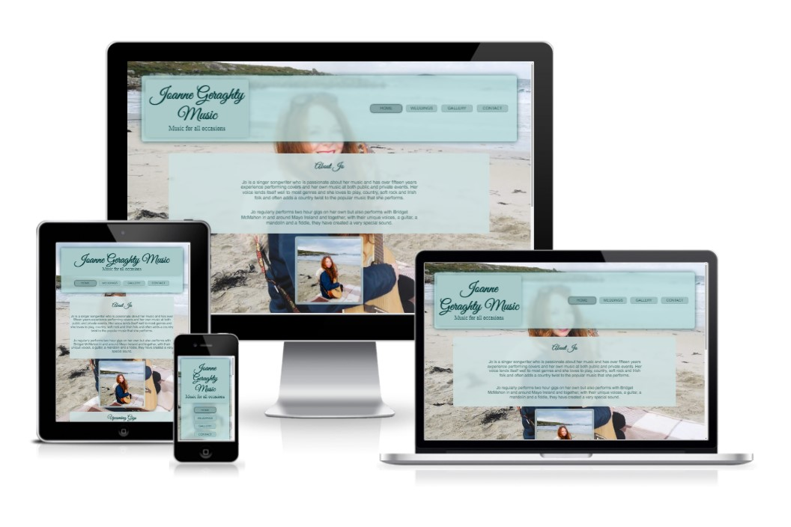
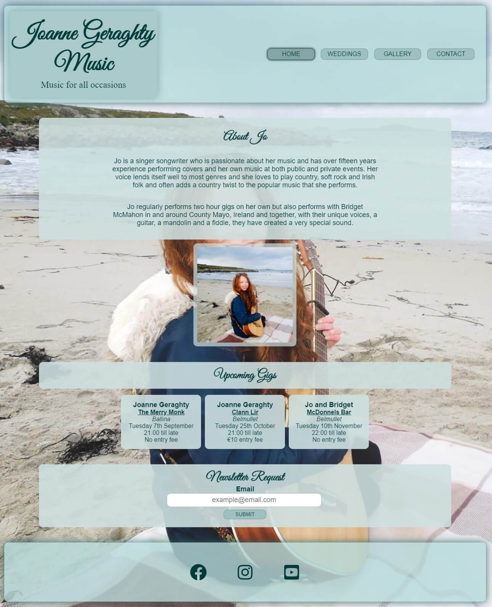

# **Joanne Geraghty Music**
The [‘Joanne Geraghty Music’](https://stephen-j-whitaker.github.io/joanne-geraghty-music/index.html) site provides a hub for Jo’s music business. It caters for fans, potential fans, prospective and current clients and curious visitors by providing the information and features required for the type of user in question to fulfil their objective or objectives. This is done through provision of details commonly sought by these user groups and provision of the intuitively arranged features they require.
 It was a goal of the design process to develop a site that would provide for a type of user’s needs without being to the detriment of another type of user. This being the case would lead to a less positive user experience. 
The overall objective is for the site to be an enjoyable destination for any user, for it to enable the user to make the most of Jos music and Jo, in turn, to gain and retain followers, increase bookings and sales and build a thriving fan base that attends her performances regularly. 

## **Contents**

1 [Project Initiation](#project-initiation)

## **1. Project Initiation**
1. Brainstorming sessions helped to ascertain the business and user needs:

    [Business opportunities and business and user needs brainstorm](docs/readme-brainstorm.pdf)

2. The opportunities were assessed for importance and viability and the minimum viable product was ascetertained:

    [Minimum viable product analysis spreadsheet](docs/readme-opportunity-analysis.pdf)

    [Minimum viable prodct analysis charts](docs/readme-scope-analysis.pdf)

4.  User needs were checked to make sure they satisfy a business opportunity:

    [User need to business opportunity connection analysis](docs/readme-user-need-business-opporuntity-link.pdf)

5. User stories with acceptance criteria were developed:

    [User stories](docs/readme-user-stories.pdf)

6. A feature list was developed from the user stories and it was ensured that the was no duplicated functionality going into development. These have acceptance criteria:

    [Feature list](docs/readme-feature-list.pdf)

## **2. Product Development**
### **Poduct Functionailty development**
### Wireframes 
Wireframes were developed for a site that incorporated all of the required features identified during project initiation to ensure all required functions were provided for.

  - [Landing page wireframes](docs/readme-wireframes-landing-page.pdf)

  - [Weddings page wireframes](docs/readme-wireframes-weddings-page.pdf)

  - [Gallery page wireframes](docs/readme-wireframes-gallery-page.pdf)

  - [Contact form page wireframes](docs/readme-wireframes-contact-form-page.pdf)

  - [User interface flow](docs/readme-user-interface-flow.pdf)

  - [Mockup with colour scheme](docs/readme-mockup-colour-scheme.pdf)

### **Product Style Development**
### Typography
  It was decided to use one cursive font and one sans serif font throughout the site. The cursive font Great Vibes ([Google Fonts](https://fonts.google.com/about)) is used for the logo and the headings on all the web pages and the sans serif font Arial is used for all other text. The use of the same 2 preffered fonts on all pages provides continuity and is intended to help the pages look unclutttered and make the site a more pleasant place to be for it's users.

### Colour Scheme
The mint green colour scheme and small pallete used for the user interface was chosen to make the site appear 'fresh' and 'light' and so help to envoke positive emotions in the user. The semi-transparency of the interface is to add to the sense 'lightness' and to provide a sense of depth to the site. The colours are used consistently throughout the site with the headers and footers being one tone of mint green and the main body of the pages being a lighter tone of mint green. All other colour is provided by the background images and, where present, gallery pictures and videos. A mix of grey scale and colour videos and photos was chosen and arranged to provide balance to the pages in which they are present without introducing clashing or overly vibrant colours that would work against the use of a mint theme used to convey a sense of calm.  

### Images
The full viewport background images with the semi transparent user interface was chosen to give an ethereal 'lightness' and depth to the site. All the images and videos used in the galleries are cropped to a square aspect ratio and same size for consistency and therefore to help produce a positive emotional response in the user.  

### Layout
A simple and consistent full page scroll with a header and 'sticky' footer was chosen as it is familiar with internet users and will be intuitive to navigate. The layout is fully responsive and, for consistency, all the features look the same on all screen sizes (although some, like the navigation bar, are arranged differently and wrap under other objects for smaller screen sizes). The header and footer is the same on all pages. With the exception of the weddings page the background image is the same on all pages for consistency. The wedding page has a wedding themed background image as deayiled in teh features specification.

### User Feedback
Any clickable or interactive feature or link will have a style change in response to an on hover event to identify the feature as interactive to the user. The change in style on occurence of a hover event is detailed in the features section.

## **3. Features**
### **Implemented Functional Features**
- ### Landing page [Feature ID 3]
  The landing page is a dependency of all of the user stories. 

  The landing page [Feature ID 3] is the site visitors welcome to the site. The background picture is Jo with a guitar to indicate she is a musician and if a user has seen JO they will know on seeing the background image that they have found the correct site. In case the background image is partially obscured by the objects on the page there is also the same picture of Jo in the about Jo section of the 'Home' Landing Page.

   

   - The Landing page contains a header and a footer that is repeated on all of the websites pages for continuity, easy of navigation and an overall better user experience. The footer will stick at the bottom of the screen where the content of the page isnt large enough to push the footer to the bottom of the view port.
   - The logo quickly identifies that site as being that of Joanne Geraghty and that the site is about her music. On hovering over the logo with a cursor or touching it with a finger on a touch sensitive device it's text gains a drop shadow to identify it as a clickable link. The link takes the user back to the Home 'Landing Page' 

      

- **Navigation Bar**

    The navigations Bar

### **Features Left to Implement**

## **Testing**

### **Functionality tests**

When all user tests have passed and the features its dependent on have past then the user story as a whole has passed.

All feature and user stories have passed all their acceptance tests so the site is deemed ready for release.

### **Code Validation**
### HTML validation
The website HTML was validated using [The W3C Markup Validation Service](https://validator.w3.org/#validate_by_uri)

### CSS Validation
The website CSS was validated using [The W3C CSS Validation Service - Jigsaw](https://jigsaw.w3.org/css-validator/)

### **Performance tests**
Lighthouse tests in dev tools in Chrome were used to verify that that website performed as required.

### **Bugs found and resolved or outstanding**
- Resolved
  - H265 mpeg video was not supported by some browsers so transcoded with [VLC](https://www.videolan.org/) to H264

  - Embedded audio in videos was not supported by IOS so transcoded with [VLC](https://www.videolan.org/) to contain AAC audio

  - Text was unreadable on Android phones on the semi-transparent backgrounds as Arial was not installed on the Android phones tested with and the browser fell back to the Android default sans serif font which was extremely thin. Google fonts Lato was added as a fallback for Arial and this resolved the issue.
  
- Outstanding
  - Selector drop down box on contact form page is not styled correctly on IOS Apple Iphone

## **Deployment**
The website is hosted by [GitHub Pages](https://pages.github.com/) from the main branch of the [joanne-geraghty-music Git repository](https://github.com/Stephen-J-Whitaker/joanne-geraghty-music). The deployment procedure can be found at the following link:

- [Deployment Procedure](docs/readme-deployment-procedure.pdf)

## **Technologies Used**
- CSS

- HTML

- [Corel Draw](https://www.coreldraw.com/en/) : Used for developing the wireframes and mockups for the product

- [Corel Photo-Paint](https://www.coreldraw.com/en/pages/photo-paint/) : Used for cropping and adjusting the photos used in the product

- [VLC](https://www.videolan.org/) : Used for transcoding video

- IOS Photos App : Used to crop videos to square aspect ratio

- [Microsoft Excel](https://www.microsoft.com/en-ie/microsoft-365/excel) : Used for documenting features and recording test results

- [Chrome](https://www.google.com/intl/en_ie/chrome/) : USed for research, development and testing (including DevTools and Lighthouse test suite)

- [Safari](https://www.apple.com/safari/) : Used for testing

- [Opera](https://www.opera.com/) : Used for testing

- [Edge](https://www.microsoft.com/en-us/edge) : Used for testing

- [Firefox](https://www.mozilla.org/en-US/firefox/new/) : Used for testing

- [Notepad++](https://notepad-plus-plus.org/downloads/) : Used for text file editing

- [GitPod](https://www.gitpod.io/) : Used for product development and testing

- [GitHub](https://github.com/) : Used for accessing committed code repositories and hosting the completed product online

- [Git](https://git-scm.com/): Used for code version control

- [Tinyjpg](https://tinyjpg.com/) : Used for image compression

- [Google Fonts](https://fonts.google.com/about) : Used for fonts

- [Font Awsome](https://fontawesome.com/) : Used to source social media svg files

- Code Institute form dump : Form data is sent to this form dump in lieu opf implemention of a custom back end process to handle the incomming form posts

- [The W3C Markup Validation Service](https://validator.w3.org/#validate_by_uri) : Used to validate the website HTML

- [The W3C CSS Validation Service - Jigsaw](https://jigsaw.w3.org/css-validator/) : Used to validate the website CSS

## **Credits**

### **Content**
- All code was written by the author, Stephen Whitaker
- The fonts "Great Vibes" and Lato were sourced on [Google Fonts](https://fonts.google.com/about)

### **Media**
- All photos and videos used are those of author (Stephen Whitaker) and his wife (Joanne Whitaker) with the exception of the weddings background photo that is of Stephen and Joanne Whitaker but was taken by [Rebecca Roundhill](https://www.rebeccaroundhill.co.uk/)

### **External Dependencies**
- Code Institute form dump : Form posts are currently sent to the Code Institue form dump in lieu of a custom back end process to handle the form posts correctly. Implention of such processes was beyound the scope of this project.

### **Other sources**
- Guidance on the markdown and structure to produce the readme was obtained from :
   - [Markdown Cheatsheet](https://github.com/adam-p/markdown-here/wiki/Markdown-Cheatsheet#code)
   - [Markdown for readme](https://docs.github.com/en/get-started/writing-on-github/getting-started-with-writing-and-formatting-on-github/basic-writing-and-formatting-syntax)

### **Acknowledgements**
- A special thank you to my mentor Maranatha Ilesanmi
- Thank you to all those who were kind enough to test and provide feedback on the product