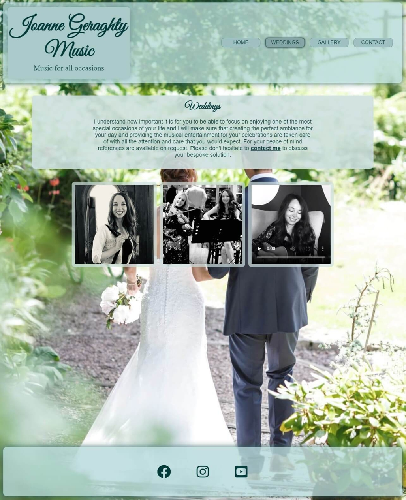
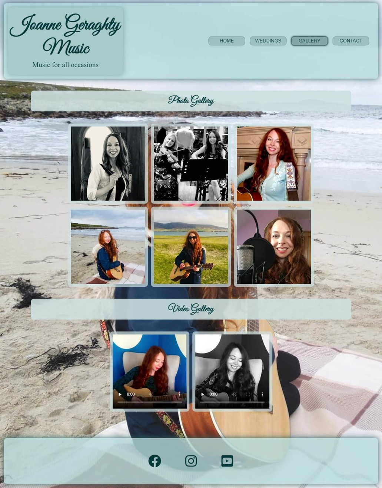
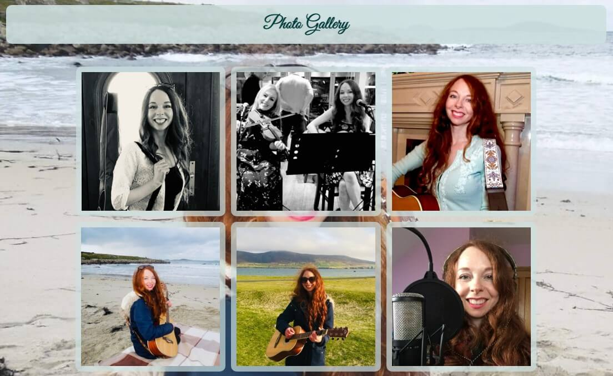
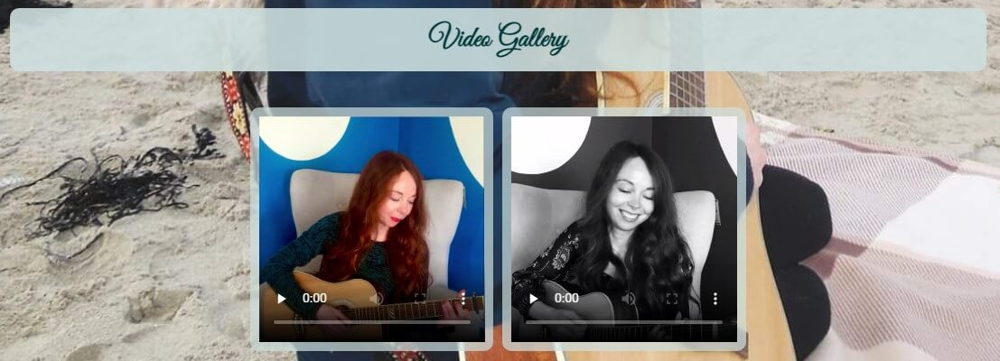
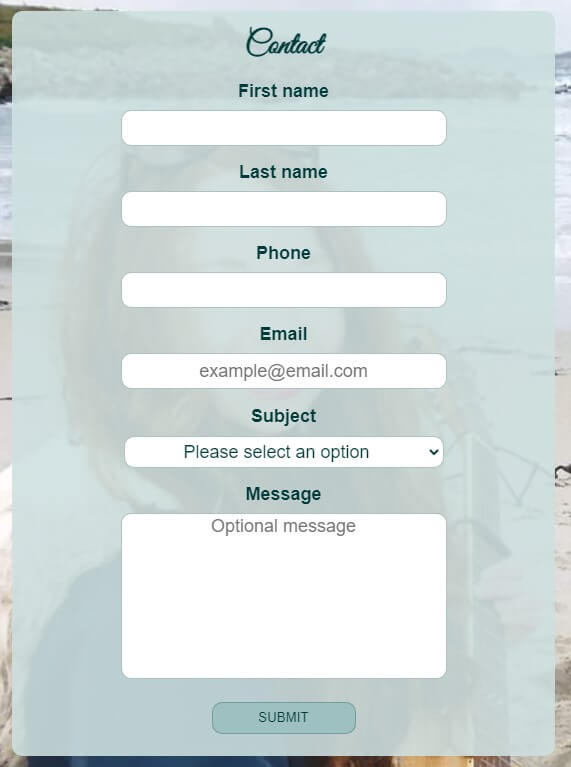

# **Joanne Geraghty Music**
The [‘Joanne Geraghty Music’](https://stephen-j-whitaker.github.io/joanne-geraghty-music/index.html) site provides a hub for Jo’s music business. It caters for fans, potential fans, prospective and current clients and curious visitors by providing the information and features required for the type of user in question to fulfill their objectives. This is done through the provision of details commonly sought by these user groups and of the intuitively arranged features they require. For the best user experience to be achieved, it was a goal of the design process to develop a site that would provide for a type of user’s needs without being to the detriment of any other type of user. The overall objective is for the site to be an enjoyable destination for any user, for it to enable the user to make the most of Jo's music and Jo, in turn, to gain and retain followers, increase bookings and sales and build a thriving fan base that attends her performances regularly. 

## **Contents**

1 [Project Initiation](#1-Project-Initiation)

2 [Website Development](#2-Website-Development)

3 [Features](#3-Features)

4 [Testing](#4-Testing)

5 [Project sign off](#5-project-sign-off)

6 [Releases](#6-Releases)

7 [Deployment](#7-Deployment)

8 [Technologies Used](#8-Technologies-Used)

9 [Credits](#9-credits)

## **1. Project Initiation**
1. Brainstorming sessions helped to ascertain the business and user needs:

    - [Business opportunities and user needs brainstorm](docs/readme-brainstorm.pdf)

2. The business opportunities were assessed for importance and viability and the minimum viable product was ascertained:

    - [Minimum viable product analysis of business opportunities](docs/readme-opportunity-analysis.pdf)

    - [Minimum viable product analysis charts](docs/readme-scope-analysis.pdf)

4.  User needs from the brainstorm were checked to make sure they satisfy a business opportunity:

    - [User need to business opportunity connection analysis](docs/readme-user-need-business-opporuntity-link.pdf)

5. User stories with acceptance criteria were developed:

    - [User stories](docs/readme-user-stories.pdf)

6. A feature list was developed from the user stories and it was ensured that there was no duplicated functionality going into development. These have acceptance criteria:

    - [Feature list](docs/readme-feature-list.pdf)

## **2. Website Development**
- ### **Website Functionalilty Development**

  - ### Wireframes 
    Wireframes were developed for a site that incorporated all of the required features identified during project initiation.

    - [Landing page wireframes](docs/readme-wireframes-landing-page.pdf)

    - [Weddings page wireframes](docs/readme-wireframes-weddings-page.pdf)

    - [Gallery page wireframes](docs/readme-wireframes-gallery-page.pdf)

    - [Contact form page wireframes](docs/readme-wireframes-contact-form-page.pdf)

    - [User interface flow](docs/readme-user-interface-flow.pdf)

    - [Mockup with colour scheme](docs/readme-mockup-colour-scheme.pdf)

- ### **Website Style Development**
  - ### Typography
    It was decided to use one cursive font, one serif and one sans serif font throughout the site. The cursive font "Great Vibes" ([Google Fonts](https://fonts.google.com/about)) is used for the logo and the headings on all the web pages, the preferred serif font "Times New Roman" is only used for the text "Music for all occasions" in the logo and the sans serif font Arial is used for all other text. The use of the same 3 preferred fonts on all pages provides continuity and is intended to help the pages look uncluttered and make the site a more pleasant place to be for its users.

  - ### Colour Scheme
    The mint green colour scheme and small monochrome pallet used for the user interface was chosen to make the site appear 'fresh' and 'light' and so help to invoke positive emotions in the user. The semi-transparency of the interface is to add to the sense 'lightness' and to provide a sense of depth to the site and the level of transparency and blur were set to make the page aesthetically pleasing whilst ensuring high levels of accessibility and that the background never distracts from the foreground information. The colours are used consistently throughout the site with the headers and footers being one tone of mint green and the main body of the pages being a lighter tone of mint green. All other colour is provided by the background images and, where present, gallery pictures and videos. A mix of grey scale and colour videos and photos was chosen and arranged to provide balance to the pages in which they are present without introducing clashing or overly vibrant colours that would work against the use of the mint theme used to invoke a tranquil ambience in the site.  

  - ### Images
    The full viewport background images with the semi transparent user interface was chosen to give an ethereal 'lightness' and depth to the site. All the images and videos used in the galleries are cropped to a square aspect ratio and are the same size for consistency to help produce a positive emotional response in the user.  

  - ### Layout
    A simple and consistent full page scroll with a header and 'sticky' footer was chosen as it's familiar with internet users and will be intuitive to navigate. The layout is responsive and, for consistency, all the features look the same on all viewport sizes (although some, like the navigation bar, are arranged differently and wrap under other objects for smaller viewport sizes). The header and footer is the same on all pages. With the exception of the weddings page the background image is the same on all pages for consistency. The wedding page has a wedding themed background image as detailed in the [feature](docs/readme-feature-list.pdf) specifications.

  - ### User Feedback
    Any clickable or interactive feature or link has a style change in response to an on hover event to identify the feature as interactive to the user. The changes in style on occurrence of a hover event are detailed in the features section below.

## **3. Features**
Features are arranged and combined, when appropriate, into the website in what was deemed to be the most intuitive and efficient manner. Multiple user stories may be dependent on a given feature and this is noted in the descriptions below. 'User story' links in this section of the readme are to the user story details and acceptance criteria for reference and the 'feature' links in this section of the readme are to the acceptance criteria for the features.
- ### **Landing page** [[Feature](docs/readme-feature-list.pdf) 'Landing Page' (ID 3)]
  - The 'Landing page' (ID 3) [feature](docs/readme-feature-list.pdf) is a dependency of all of the [user stories](docs/readme-user-stories.pdf). 
  - Implemented in [index.html](index.html)

  The landing page (Home) is the site visitors welcome to the site. The background picture, fixed position and scaled to cover the whole viewport, is Jo with a guitar to indicate she is a musician and if a user has seen Jo before then they will know on seeing the background image that they have found the correct site. A light coloured background picture was chosen with colours that harmonise with the colours of the interface and helps set the mood of the page and the site as a whole. In case the background image is partially obscured by the objects on the page (dependent on viewport size) the same picture of Jo is also in the 'About Jo' section of the Landing Page (Home). Through testing and adjustment of the text background transparency and blur it was ensured that the background image doesn't distract from the foreground information.
 
  

   - #### **Header and Footer**
     The Landing page contains a header and a footer that is repeated on all of the website's pages for continuity, ease of navigation and an overall better user experience. The footer will stick at the bottom of the viewport should the content of the page not be large enough to 'push' the footer to the bottom of the viewport. The header and the footer are the same colours and are semi-transparent to give the website a 'light' and airy feel and to reveal the background image through them. They are a slightly darker tone of the same colour as the rest of the user interface and have a subtle drop shadow to 'lift' them away from the main content and to give the site an illusion of depth. Both the header and footer and their contents, where necessary, are responsive and resize so they are accommodated by smaller viewports.
      - #### **Header**
        

        - #### **Logo**
          The logo is located on the header of the website and it quickly identifies the site as being that of Joanne Geraghty. It also informs the user that the site is about Jo's music. On hovering over the logo with a cursor or touching it with a finger on a touch sensitive device its text gains a drop shadow to identify it as a clickable link. The link takes the user back to the 'Landing Page' (Home). The preferred font of "Joanne Geraghty Music" Google Fonts "Great Vibes" combined with the less emphasised line of the logo "Music for all occasions" is felt to add to the beauty of the site. The font colour is a deep tone of the header colour which is aesthetically pleasing and provides sufficient contrast between the text and the background for the site to achieve the necessary level of accessibility. 
         
          

        - #### **Navigation Bar** 
          The navigation bar is an easy way for the user to navigate and explore the site intuitively and without the use of the browser back button. It has links to the other website pages in the order of importance as decided by the business. The weddings page is second in the list due to the wedding offering's importance to the business. The navigation anchor links are in an ordered list in the html to show that their order should be maintained. The navigation bar is responsive and the navigation buttons will wrap under the logo on small viewports in the same order when read left to right, top to bottom. The colours used for the navigation bar are tones of the header and footer colour to make its appearance pleasing to the eye and the buttons gain a drop shadow and, for user feedback, will change to a deeper tone on hovering over them with a cursor or touching them on a touch sensitive device. To indicate the page that the user is currently on, the navigation button of that page has the same style as is used on hover or touch. 
          
          
      
      - #### **Footer**
        The footer is the same colours as the header and has the same style drop shadow as the header for consistency, aesthetics and the best user experience. It contains the social media links.
        
        

        - #### **Social Media Links** [[Feature](docs/readme-feature-list.pdf) 'Social Media Links' (ID 8)]
          - The 'Social Media Links' (ID 8) [feature](docs/readme-feature-list.pdf) are a dependency of [user stories](docs/readme-user-stories.pdf) 3, 7, 8, 9, 11 and 12. 

          The social media links (svg icons sourced from [Font Awsome](https://fontawesome.com/)) will take the user to the social media pages of Joanne Geraghty so that the user can follow Jo or view additional information not available on the site. They all open in a new tab for the benefit of user experience. On hovering over them with a cursor or touching them they gain a surrounding box with a drop shadow as feedback to the user that indicates that they are a clickable link. They are the same colour as the logo text for aesthetics. SVG icons were chosen to ensure they would always be as sharp as possible if resizing became necessary for site responsiveness.

          

  - #### **About Jo** [[Feature](docs/readme-feature-list.pdf) 'Information about Jo’s music' (ID 1) : [Feature](docs/readme-feature-list.pdf) 'Information about Jo’s services provided' (ID 5) : [Feature](docs/readme-feature-list.pdf) 'Jo Bio' (ID 10)]
    - The 'Information about Jo’s music' (ID 1) [feature](docs/readme-feature-list.pdf) is a dependency of [user story](docs/readme-user-stories.pdf) 1.
    
    - The 'Information about Jo’s services provided' (ID 5) [feature](docs/readme-feature-list.pdf) is a dependency of [user stories](docs/readme-user-stories.pdf) 3, 4, 6, 9, 10 and 12.

    - The 'Jo Bio' (ID 10) [feature](docs/readme-feature-list.pdf) is a dependency of [user story](docs/readme-user-stories.pdf) 10.

    The 'About Jo' section of the landing page (Home) combines required [features](docs/readme-feature-list.pdf) 'Information about Jo’s music' (ID 1), 'Information about Jo’s services provided' (ID 5) and 'Jo Bio' (ID 10). The section has its own heading in the same green used for the page logo and the font is "Great Vibes" the same as is used for all headings on the website. It gives an overview of Jo as a performer and details about her talents, who she performs with and some information about her gigs. The information is on a semi-transparent background of a lighter tone than the header and footer that lets the background image penetrate through. The preferred font is Arial and the font colour is a deeper tone of the header and the footer colour and is the same colour that is used in the logo in the header to ensure accessibility by maintaining sufficient contrast of colours on the website.

    The image in the section is the same image as is used for the background of the page as an alternative in case, due to the size of the viewport and the background images responsive nature, too much of the background image of Jo is obscured for her to be easily identified. The image is square, of fixed size and is styled with a thin semi-transparent green border that is the same colour as the background of the text part of the section. The fixed size was chosen to ensure that the page would look aesthetically pleasing with the image still being sharp and clear and the subject being easily identifiable. The same size and style of image is used across the whole site for consistency whilst ensuring the images are always of a high quality and to maintain the good performance of the site. Videos are sized and styled the same way as the images for the same reasons. For accessibility, the 'alt' attribute is used for all images in the website.

    

  - #### **Upcoming Gigs** [[Feature](docs/readme-feature-list.pdf) 'Upcoming Gigs' (ID 4)]
    - The 'Upcoming Gigs' (ID 4) [feature](docs/readme-feature-list.pdf) is a dependency of [user stories](docs/readme-user-stories.pdf) 2, 5, 7, 8 and 11.
    
    The 'Upcoming Gigs' section of the landing page (Home) contains information about Jo's upcoming performances for any user that wishes to attend one of her performances. The section has its own heading in the same green used for the page logo and the font is "Great Vibes" the same as is used for all headings on the page. The header has a background strip that is the same semi-transparent green style as the background used for the 'About Jo' section. The strip is responsive and reduces in length to fit on smaller viewport sizes though the font of the heading remains the same size. Each gig is in its own container which is easily identified, duplicated or removed from the code should gigs need modifying, adding or removing. The name or names of the performer or performers, if a duo, the name of the venue, the town of the venue, the gig's date, start time and entry fee are listed and arranged in a column in the order of importance. The name or names of the performers and the venue name are bold to show they are more important than the information to follow within the gig container and in the same colour as the logo for consistency, aesthetics and accessibility through contrast with the background colour. The town of the venue, date of performance, time of performance and entry fee are the same colour as the performer or performers name and the venue name, but are not bold. They are not bold as this information is deemed of lower importance than the performers and venue names. The gigs section is responsive and the gig containers will wrap under each other should the viewport size necessitate them to. If a single gig container wraps onto a new row it's centralised on that row. I decided to deviate from the wireframe design in this case as on testing I found that I preferred how this centralised arrangement looked. The gig containers always retain their shape and size. The shape and size were chosen for compatibility and readability on likely viewport sizes. Each gig container is a clickable link to the website of the venue which will open the venue's website in a new tab. The name of the venue is underlined and the whole gig container will go opaque from semi-transparent and gain a drop shadow on hover or touching to indicate that it is a clickable link.

    

  - #### **Newsletter Request** [[Feature](docs/readme-feature-list.pdf) 'Newsletter Signup' (ID 9)]
    - The 'Newsletter Signup' (ID 9) [feature](docs/readme-feature-list.pdf) is a dependency of [user stories](docs/readme-user-stories.pdf) 7, 8 and 10.

    The 'Newsletter Request' section of the landing page (Home) is a form that enables the user to enter their email address to request being added to the newsletter mailing list. It is assumed that the user will be familiar with the concept of a newsletter and so, to keep the page uncluttered and to make it more aesthetically pleasing, this section has no text apart from its heading, (the preferred font being the same "Great Vibes" font as is used for the other headings on the website), the label for the input field, the text in the input field and "Submit" on the submit button. The colour of the heading and the label is the same green as is used for the logo on all the website pages. To handle user error, the email input field validates the input and being a 'required' field means that the form will not submit without the field being populated. Being an input of type email it will not allow the submission of the form if the field is missing the @ symbol. For aesthetics, the text in the email input field is a tone of the same green used throughout the user interface. The submit button is the same opaque green as is used for the navigation buttons for continuity and, also for continuity, all the components of the 'Newsletter Request' section are on a semi-transparent green section wide background of the same style as the other headings and the 'About Jo' section of the page. The section is responsive and the email input field will slightly shorten to fit on small viewport sizes. On hover the input field will gain a drop shadow and as user feedback that they have selected the field it will retain the drop shadow when clicked and in focus. In lieu of a dedicated backend process the form is submitted to the Code Institute Form Dump which opens in a new tab and displays the data sent from the form. Using the form dump serves the purpose of confirming the form submits as intended and means that the 'flow' of the site is as it would be if a dedicated backend process was in place. When a dedicated backend process is implemented the site Submit button will become inactive and the text on it will state "Submitted" for confirmation of a successful submission.

    

- ### **Weddings Page** [[Feature](docs/readme-feature-list.pdf)] 'Wedding offering page with wedding gallery' (ID 7)]
  - The 'Wedding offering page with wedding gallery' (ID 7) [feature](docs/readme-feature-list.pdf) is a dependency of [user story](docs/readme-user-stories.pdf) 6.
  - Implemented in [weddings.html](weddings.html)

  The 'Weddings Page' is a way for a potential client to get a feel for how Jo approaches a wedding event. It is laid out the same way as the landing page (Home). The header and footer and all associated features of these are identical to the landing page (Home) in all ways with the exception that its the 'Weddings' navigation button thats styled differently from the rest to indicate that its the Weddings page that the user is in. The background is styled the same as the landing page (Home) but instead of it being an image of Jo with a guitar on a beach its a wedding themed picture to set the scene for the page. A different background is used in this case to help a person planning their wedding enjoy their visit to the page as much as possible, they will feel like weddings are treated in a special way, and this is intended to increase the chance of a booking. The colours in the background are predominantly greens that harmonise with those of the header, footer and semi-transparent section backdrops and contribute to the desired calm feel of the site which is intended invoke a positive emotional response in the user and therefore improve the user experience. Through testing and adjustment of the text background transparency and blur it was ensured that the background image doesn't distract from the foreground information.

   

   - **Weddings Section**
  
     The main body of the Weddings page is the Weddings section which consists of a short write up describing how Jo will approach providing music for a wedding, followed by a small gallery to give an idea of what a client can expect Jo to look and sound like should Jo or Jo in her duo be booked for a wedding event. The write up is styled the same way as the 'About Jo' section. 
     
     The informative part of the section has its own heading in the same green used for the page logo and the font is "Great Vibes" the same as is used for all headings on the page. The text is on a semi-transparent background of a lighter tone than the header and footer that lets the background image penetrate through. The preferred font is Arial and the font colour is a deeper tone than that of the header and footer and is the same colour that is used in the logo and headers to ensure accessibility by maintaining sufficient contrast of colours on the website.

     The gallery contains two pictures and one video and they are styled the same as the image in the 'About Jo' section on the landing page (Home). The images and video are square, of fixed size and is styled with a thin semi-transparent green border that is the same colour as the background of the text part of the section. The video doesn't play until the user initiates play using the controls present on top of the video 'poster'. The play button in the controls on top of the video indicates that the video gallery item is a playable video. For accessibility, the 'alt' attribute is used for all images in the website and the 'aria-label' attribute is used for all videos. 

     The section as a whole is responsive. The text section resizes, though the font of the heading and the content stays the same size, and the gallery will wrap so that they are arranged as a column on smaller viewports.

     

- ### **Gallery Page** [[Feature](docs/readme-feature-list.pdf)] 'Gallery page (image / video)' (ID 6)]
  - The 'Gallery page (image / video)' (ID 6) [feature](docs/readme-feature-list.pdf) is a dependency of [user stories](docs/readme-user-stories.pdf) 3, 4, 9, 10, 11 and 12.
  - Implemented in [gallery.html](gallery.html) 

  The 'Gallery Page' holds pictures and videos of Jo that can be used for site user interest or research into whether they would like to book Jo or go to one of her gigs. Its laid out the same way as the landing page (Home). The header and the footer and all associated features of these are identical to the landing page (Home) in all ways with the exception that its the 'Gallery' navigation button thats styled differently from the rest to indicate that it is the Gallery page that the user is on. The background image is the same image as the one on the landing page (Home) and it's styled the same way, fixed position and is scaled to cover the whole viewport.

  

  - **Photo Gallery Section**

    The pictures gallery section has a header that is styled the same as the header used for 'Upcoming Gigs'. The gallery contains a copy of all images to be found across the site (with the exception of the wedding page background image as this is not related to Jos music) to ensure that a visitor who does not visit all of the rest of the site has the opportunity to see all of the pictures. The images are styled the same as the other non-background images on the site (as described in the 'Weddings' section) for consistency.  

    

  - **Video Gallery Section**
  
    The Videos Gallery section has a header that is styled the same as the header used for 'Pictures Gallery' and contains a copy of any videos that are to be found on the rest of the site to ensure that a visitor who does not visit all of the rest of the site has the opportunity to see all of the videos available. The videos are styled the same as the other videos on the site (as described in the 'Weddings' section) and none will play automatically on page load for consistency and the best user experience.

    

- ### **Contact Page** [[Feature](docs/readme-feature-list.pdf)] 'Contact Form' (ID 2)]
  - The 'Contact Form' (ID 2) [feature](docs/readme-feature-list.pdf) is a dependency of [user stories](docs/readme-user-stories.pdf) 1, 2, 3, 4, 5, 6, 9, 10 and 12.
  - Implemented in [contact.html](contact.html)

  The contact page allows any site user who wants to contact Jo to do so. The 'Contact Page' is laid out the same way as the landing page (Home). The header and the footer and all associated features of these are identical to the landing page (Home) in all ways with the exception that its the 'Contact' navigation button thats styled differently from the rest to indicate that it is the Contact page that the user is on. The background image is the same image as the one on the landing page (Home) and it's styled the same way.

  

  - **Contact form**

    The contact form allows for validated inputs of the data shown in the image below. It's header, background, input boxes and submit button are styled in the same way as the 'Newsletter Request' section for consistency. The first name and last name fields are required fields and only allow upper and lower case alphabetical characters to be input. The phone field is a required field that only allows numbers. The email field is required and only allows a character string that contains an @ symbol. The Subject drop down is a required field that allows the user to select one of the 4 options 'Wedding', 'Event', 'Venue' or 'Other'. Lastly there is an optional text box for a custom message to Jo. The contact form is responsive and will become narrower on smaller viewports. In lieu of a dedicated backend process the form is submitted to the Code Institute Form Dump which opens in a new tab and displays the data sent from the form. Using the form dump serves the purpose of confirming the form submits as intended and means that the 'flow' of the site is as it would be if a dedicated backend process was in place. When a dedicated backend process is implemented the site "Submit" button will become inactive and the text on it will state "Submitted" for confirmation of a successful submission.

    
- ### **Features for future versions**
  When Jo has recorded her own material it will be on streaming platforms and the site will provide links to her music on those platforms. Links to ecommerce sites where fans can buy Jos digital and physical (CD) format music will also be provided and later sales will be possible directly from this Joanne Geraghty Music site.

## **4. Testing**
  - ### **Code Validation**

    - #### **HTML validation**
       The website HTML was validated using [The W3C Markup Validation Service](https://validator.w3.org/#validate_by_uri)

       

    - #### CSS Validation
      The website CSS was validated using [The W3C CSS Validation Service - Jigsaw](https://jigsaw.w3.org/css-validator/)

      

- ### **Performance tests**
  Lighthouse tests in dev tools in Chrome were used to verify that that website performed as required.

  

 - ### **Functionality tests**
   When all user tests have passed and the features it's dependent on have past then the user story as a whole has passed. Tests were carried out on the [‘Joanne Geraghty Music’](https://stephen-j-whitaker.github.io/joanne-geraghty-music/index.html) site deployed on GitHub Pages.

   - #### [User story acceptance tests](docs/readme-user-story-acceptance.pdf)

   - #### [Feature acceptance tests](docs/readme-feature-acceptance.pdf)
       - Note : The site has not yet been tested on any Linux based desktop operating systems.

    - Responsiveness
      
      In additions to the above tests the website was frequently tested for responsiveness in Chrome DevTools and on mobile devices in landscape and portrait mode. The site's responsiveness was also tested on an Apple iPad in portrait and landscape mode and it performed well rearranging and resizing the pages as necessary. How the site responds as necessary on smaller viewports is described in the features sections and the site performed as per its design. Flex is used a lot in the implementation of the design and this automatically arranges parts of the page in response to different screen sizes. For example the gig information containers wrap under each other on smaller screens and so do gallery images and videos. Media queries are used where further changes to the layout and size of interface components are needed to accommodate screen size changes. The main logo text is increased in size when the screen width is 640px and above. This has the effect of making the logo larger on screens at this size and above. When the screen width is above 1100px (the required width for these changes was determined in Chrome DevTools) the flex property for the navigation elements is changed to flex-end from center to ensure they position to the right hand side of the header. On screens 1100px and above the background of the contact form becomes 40% of its parent width to restrict its size and keep it looking aesthetically pleasing and the newsletter email input box becomes slightly longer, again for aesthetics. 

       - [Examples of responsiveness](docs/readme-responsiveness-examples.pdf)
  - ### **Other testing**
    The site was made available to numerous people to test at various stages of development and their feedback was taken into consideration. People were asked to check the sites responsiveness and functionality on their devices and provide feedback on the useability. One of my main priorities was to confirm that the background images don't distract from the foreground information and recent testing has confirmed that they don't.

- ### **Bugs found and resolved or current**
  - Pre acceptance bugs / issues : resolved
    - Note : Selector drop down box on contact form page is not styled correctly on Apple iPhone IOS - this cannot be resolved without webkit CSS extensions and so is not deemed a website bug.

    - Note : Fixed background property is disabled by Apple IOS. The background is rendered in a slightly different way on IOS compared to other operating systems but still looks acceptable. 

    - H265 MPEG video is not supported by some browsers. Bug resolution : Transcoded with [VLC](https://www.videolan.org/) to H264.

    - Embedded audio in videos is not supported by IOS. Bug resolution : Transcoded with [VLC](https://www.videolan.org/) to contain AAC audio.

    - Text was unreadable on Android phones on the semi-transparent backgrounds as Arial was not installed on the Android phones tested with and the browser fell back to the Android default sans serif font which was extremely thin. Bug resolution : Google fonts Lato was added as a fallback for Arial.
 
  - Acceptance bugs / issues
  
    - See the [Feature acceptance tests](docs/readme-feature-acceptance.pdf) spreadsheet

## **5. Project sign off**
 - [Project sign off](docs/readme-project-sign-off.pdf)

    All feature and user stories have passed all their acceptance tests so the site is deemed ready for release.

## **6. Releases**

- ###  Version 1.0 First release : Date 19/09/2022

## **7. Deployment**
The website is hosted by [GitHub Pages](https://pages.github.com/) from the main branch of the [joanne-geraghty-music Git repository](https://github.com/Stephen-J-Whitaker/joanne-geraghty-music). The deployment procedure can be found at the following link:

- [Deployment Procedure](docs/readme-deployment-procedure.pdf)

- The live site can be found [here](https://stephen-j-whitaker.github.io/joanne-geraghty-music/index.html)

## **8. Technologies Used**
- CSS

- HTML

- [Corel Draw](https://www.coreldraw.com/en/) : Used for developing the wireframes and mockups for the website

- [Corel Photo-Paint](https://www.coreldraw.com/en/pages/photo-paint/) : Used for cropping and adjusting the photos used in the website

- [VLC](https://www.videolan.org/) : Used for transcoding video

- IOS Photos App : Used to crop videos to square aspect ratio

- [Microsoft Excel](https://www.microsoft.com/en-ie/microsoft-365/excel) : Used for documenting features and recording test results

- [Chrome](https://www.google.com/intl/en_ie/chrome/) : Used for research, development and testing (including DevTools and Lighthouse test suite)

- [Safari](https://www.apple.com/safari/) : Used for testing

- [Opera](https://www.opera.com/) : Used for testing

- [Edge](https://www.microsoft.com/en-us/edge) : Used for testing

- [Firefox](https://www.mozilla.org/en-US/firefox/new/) : Used for testing

- [Notepad++](https://notepad-plus-plus.org/downloads/) : Used for text file editing

- [GitPod](https://www.gitpod.io/) : Used for product development and testing

- [GitHub](https://github.com/) : Used for accessing committed code repositories and hosting the completed product online

- [Git](https://git-scm.com/): Used for code version control

- [Tinyjpg](https://tinyjpg.com/) : Used for image compression

- [Google Fonts](https://fonts.google.com/about) : Used for fonts "Great Vibes" and Lato

- [Font Awsome](https://fontawesome.com/) : Used to source social media svg files

- Code Institute form dump : Form data is sent to this form dump in lieu of implementation of a custom back end process to handle the incoming form posts

- [The W3C Markup Validation Service](https://validator.w3.org/#validate_by_uri) : Used to validate the website HTML

- [The W3C CSS Validation Service - Jigsaw](https://jigsaw.w3.org/css-validator/) : Used to validate the website CSS

## **9. Credits**

- ### **Content**
  - All code was written by the author, [Stephen Whitaker](https://github.com/Stephen-J-Whitaker)
  - The fonts "Great Vibes" and Lato were sourced on [Google Fonts](https://fonts.google.com/about)

- ### **Media**
  - All photos and videos used are those of the author, [Stephen Whitaker](https://github.com/Stephen-J-Whitaker), and [Joanne Whitaker (Geraghty)](https://stephen-j-whitaker.github.io/joanne-geraghty-music/index.html) with the exception of the weddings page background photo that is of Stephen and [Joanne Whitaker (Geraghty)](https://stephen-j-whitaker.github.io/joanne-geraghty-music/index.html) and was taken by [Rebecca Roundhill](https://www.rebeccaroundhill.co.uk/)

- ### **External Dependencies**
  - Code Institute form dump : Form posts are currently sent to the Code Institute form dump in lieu of a custom back end process to handle the form posts correctly. Implementation of such processes was beyond the scope of this project.

- ### **Other sources**
  - Guidance on the markdown and structure to produce the readme was obtained from :
    - [Markdown Cheatsheet](https://github.com/adam-p/markdown-here/wiki/Markdown-Cheatsheet#code)
    - [Markdown for readme](https://docs.github.com/en/get-started/writing-on-github/getting-started-with-writing-and-formatting-on-github/basic-writing-and-formatting-syntax)

- ### **Acknowledgements**
  - A special thank you to my mentor Maranatha Ilesanmi
  - Thank you to all those who were kind enough to test the website and provide feedback

  ## [Back to top](#contents)